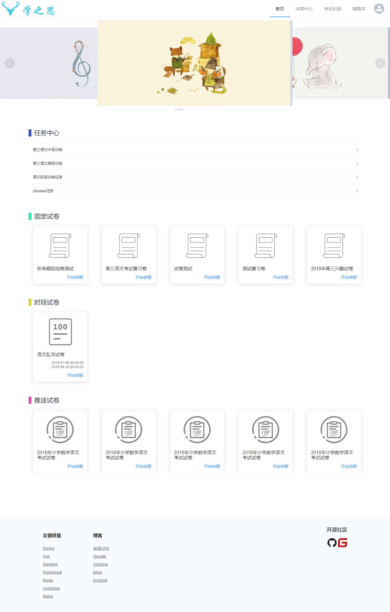
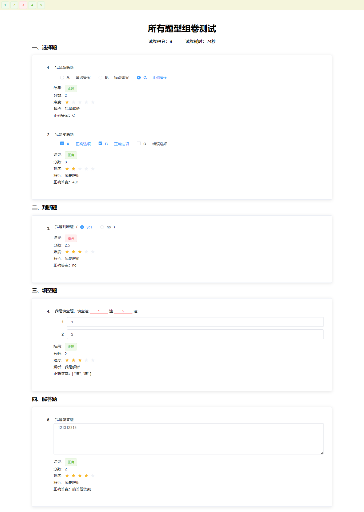
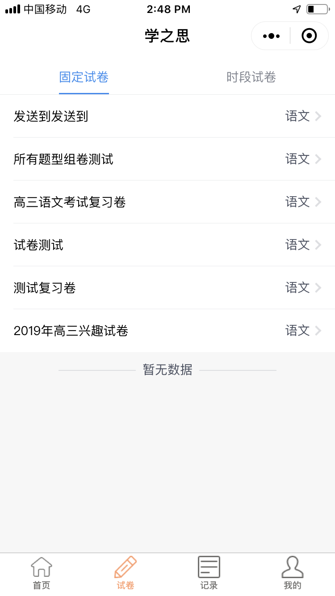
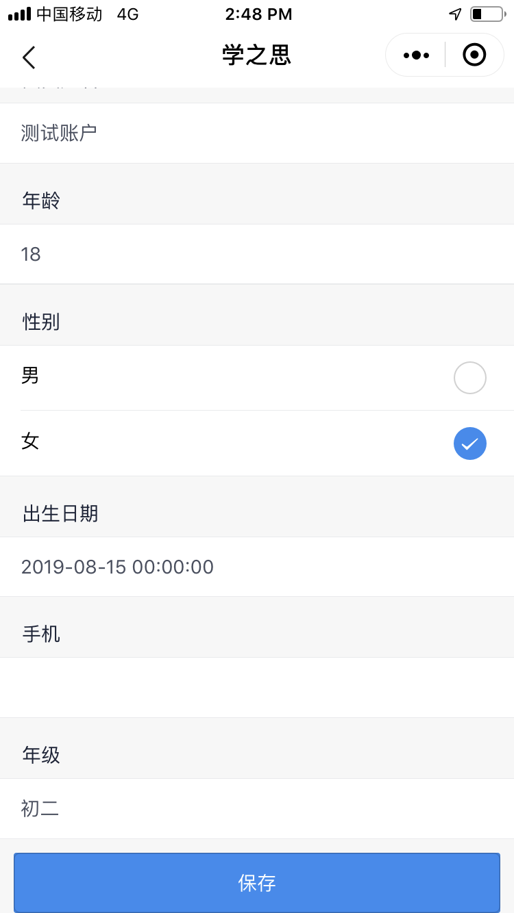
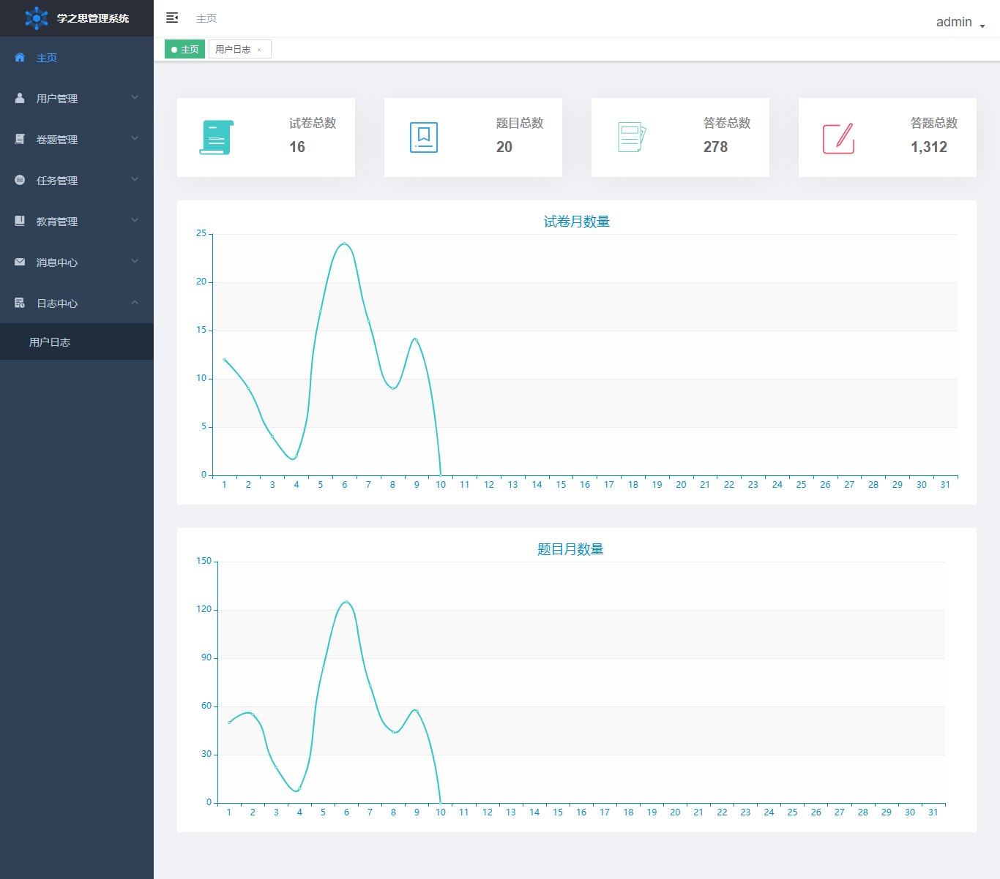
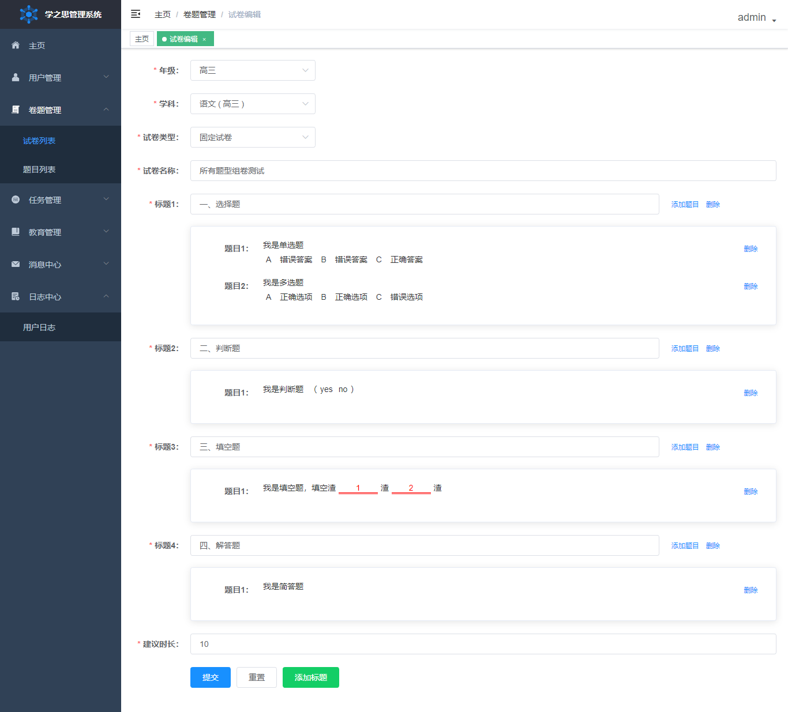

## 项目介绍

西电快乐考试开源考试系统是一款 java + vue 的前后端分离的考试系统。主要优点是开发、部署简单快捷、界面设计友好、代码结构清晰。支持web端和微信小程序，能覆盖到pc机和手机等设备。
支持多种部署方式：集成部署、前后端分离部署、docker部署。

### 系统展示

* 学生考试系统
<table>
    <tr>
        <td></td>
        <td></td>
    </tr>
</table>

*  小程序考试系统
<table>
    <tr>
        <td></td>
        <td></td>
        <td></td>
        <td></td>
    </tr>
    <tr>
        <td></td>
        <td></td>
        <td></td>
        <td></td>
    </tr>
</table>

* 后台管理系统

<table>
    <tr>
        <td></td>
        <td></td>
    </tr>
</table># uexam
# uexam
